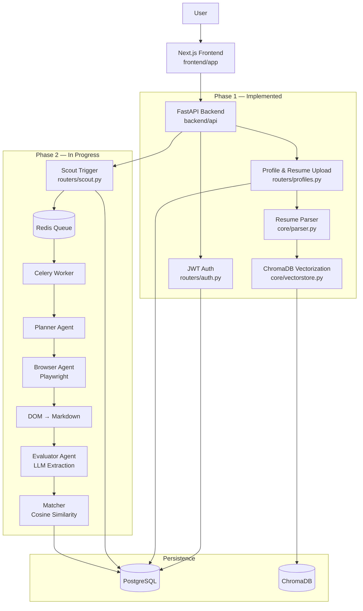

# ScoutSphere

<div align="center">


<h3>An autonomous multi-agent opportunity discovery & application engine</h3>

<p><em>ScoutSphere is a personalized AI scout that navigates the web to find internships and hackathons, evaluates them against your profile, and assists you in applying — with a mandatory human-in-the-loop review before anything is ever submitted.</em></p>

</div>

> ⚠️ **This project is under active development as a semester-length capstone build.** Phase 1 (foundation, auth, profile persistence, infra) is implemented and functional; the autonomous scouting pipeline, semantic matching, and application co-pilot from later phases are in progress. See [Project status](#-project-status) below for exactly what works today.

## ✨ What ScoutSphere does (vision)

Students and early-career professionals lose hours every week manually checking Devpost, company career pages, and university boards for internships and hackathons — and still miss deadlines or apply to roles they're not eligible for. ScoutSphere is designed to close that loop end-to-end:

- **Autonomous Scouting**: Background agents crawl predefined seed URLs on a schedule, extract listings from dynamically rendered pages, and convert the DOM into clean Markdown for LLM parsing.
- **AI Evaluation Engine**: An LLM chain (GPT-4o-mini) extracts structured opportunity data (title, deadline, requirements) and scores it against a vector-embedded user profile via cosine similarity across five weighted factors — Skills, Eligibility, Location, Experience, and Deadline Urgency.
- **Personalized Discovery Dashboard**: Curated, match-scored opportunities surface on a Tinder-style feed instead of a fragmented, manual search.
- **Form-Filler Co-Pilot**: A Playwright-driven agent maps profile data onto real application forms, then **pauses for mandatory human review** — the system never submits on autopilot.
- **Notifications**: Daily/weekly digest emails surface high-match, high-urgency opportunities the user hasn't seen yet.

## 🧭 Project status

Built in phases, following the project's own Implementation Plan. Current state:

| Phase | Scope | Status |
| --- | --- | --- |
| **Phase 1** | FastAPI foundation, JWT auth, PostgreSQL schema + Alembic migrations, Redis/Celery infra, resume upload & parsing, ChromaDB profile vectorization, onboarding/auth UI, Docker sandbox spike, CI | ✅ Implemented |
| **Phase 2** | Planner / Browser / Evaluator agents, scouting pipeline, `agent_tasks` state machine execution | 🚧 In progress (scaffolding present: `backend/agents/`, `backend/tasks/`) |
| **Phase 3** | Match scoring UI, Discovery Dashboard, AI Match Analysis view | 🚧 UI scaffolding only |
| **Phase 4** | Form-Filler agent, side-by-side Co-Pilot review UI, application tracking Kanban | ⏳ Not started |
| **Phase 5** | Observability, digest emails, deployment, hardening | ⏳ Not started |

This README documents the system as a whole (per the project's SRS/PRD/TRD), but treat anything not marked ✅ above as architecture-in-progress, not a working feature yet.

## 🧠 Architecture overview



## 🧩 Core components

| Area | Purpose | Key files |
| --- | --- | --- |
| **FastAPI app** | App entrypoint, CORS, router mounting, health checks | [backend/api/main.py](backend/api/main.py) |
| **JWT authentication** | Register/login, password hashing, access & refresh tokens | [backend/api/routers/auth.py](backend/api/routers/auth.py), [backend/core/security.py](backend/core/security.py) |
| **Profile & resume** | Resume upload, PDF parsing, profile persistence | [backend/api/routers/profiles.py](backend/api/routers/profiles.py), [backend/core/parser.py](backend/core/parser.py) |
| **Vector store** | Embeds resume/profile data into ChromaDB for semantic matching | [backend/core/vectorstore.py](backend/core/vectorstore.py) |
| **Database models** | SQLAlchemy models mirroring the Backend & Database Schema doc | [backend/models/](backend/models) |
| **Migrations** | Alembic schema history | [backend/alembic/versions/](backend/alembic/versions) |
| **Agent engine** *(in progress)* | Planner, Browser (Playwright), Evaluator, Matcher agents | [backend/agents/](backend/agents) |
| **DOM-to-Markdown spike** | Technical spike converting rendered HTML to LLM-ready Markdown | [backend/scripts/dom_to_markdown.py](backend/scripts/dom_to_markdown.py) |
| **Background jobs** | Celery app, beat schedule, scouting task definitions | [backend/core/celery_app.py](backend/core/celery_app.py), [backend/worker/](backend/worker), [backend/tasks/](backend/tasks) |
| **Playwright sandbox** | Isolated Docker environment for headless browsing | [backend/docker/Dockerfile.playwright](backend/docker/Dockerfile.playwright) |
| **Frontend app** | Auth, onboarding, dashboard shell (Next.js App Router) | [frontend/app/](frontend/app) |
| **UI components** | Glassmorphic design system components (Stitch-inspired tokens) | [frontend/components/](frontend/components) |

## 🛠 Tech stack

- **Backend**: Python 3.11+, FastAPI, Uvicorn, Pydantic v2, SQLAlchemy 2.0 (async)
- **Database**: PostgreSQL (relational), ChromaDB (vector store), Alembic (migrations)
- **Auth**: JWT (python-jose), bcrypt password hashing (passlib)
- **Background Jobs**: Celery + Redis (Celery Beat for scheduled scouting)
- **Agent Engine**: Playwright (headless browsing), Groq / OpenAI GPT-4o-mini (planned for Evaluator LLM chain)
- **Resume Parsing**: pypdf
- **Frontend**: Next.js 16 (App Router), React 19, Tailwind CSS v4, Recharts, Lucide Icons
- **Testing**: pytest, pytest-asyncio, httpx
- **DevOps**: Docker Compose (Postgres, Redis, ChromaDB), GitHub Actions CI

## 📁 Repository layout

```text
.
├── backend/
│   ├── agents/            # Planner, Browser, Evaluator, Matcher (Phase 2)
│   ├── alembic/            # Migration environment and version history
│   ├── api/
│   │   └── routers/        # auth, profiles, scout, opportunities
│   ├── core/                # Settings, DB session, security, parser, vectorstore, Celery app
│   ├── docker/              # Playwright sandbox Dockerfile
│   ├── models/               # SQLAlchemy ORM models (users, profiles, agent_tasks, ...)
│   ├── schemas/               # Pydantic request/response schemas
│   ├── scripts/                 # DOM-to-Markdown technical spike
│   ├── tasks/                    # Celery task definitions (scouting)
│   ├── tests/                     # pytest suite
│   ├── worker/                     # Celery beat schedule & config
│   └── requirements.txt
├── frontend/
│   ├── app/
│   │   ├── (dashboard)/            # Opportunities, matches, profile, settings
│   │   ├── auth/login/               # Auth screen
│   │   └── onboarding/                 # Resume upload / preferences wizard
│   └── components/                       # Shared UI components (GlassCard, Button, Input, MatchCard)
├── .github/workflows/                       # CI pipeline
├── docker-compose.yml                        # Postgres, Redis, ChromaDB (local dev infra)
└── .env.example
```

## ⚙️ Prerequisites

- **Python 3.11+**
- **Node.js 18+** and **npm**
- **Docker Desktop** (or Docker Engine + Compose) for Postgres/Redis/ChromaDB
- *Optional*: an OpenAI or Groq API key for later phases (not required for Phase 1)

## 🔐 Environment variables

Copy [.env.example](.env.example) to `.env` in the project root and fill in real values (never commit `.env`):

| Variable | Required | Purpose |
| --- | --- | --- |
| `DATABASE_URL` | **Yes** | Async PostgreSQL connection string |
| `JWT_SECRET_KEY` | **Yes** | Signing key for access/refresh tokens |
| `REDIS_URL` | **Yes** | Redis connection for Celery broker/backend |
| `CHROMA_HOST` / `CHROMA_PORT` | **Yes** | ChromaDB connection for profile embeddings |
| `ACCESS_TOKEN_EXPIRE_MINUTES` | Optional | Access token lifetime (default: `30`) |
| `REFRESH_TOKEN_EXPIRE_DAYS` | Optional | Refresh token lifetime (default: `7`) |
| `RESUME_STORAGE_DIR` | Optional | Local storage path for uploaded resumes |
| `RESUME_ENCRYPTION_KEY` | Optional | Fernet key for encrypting resume files at rest |
| `OPENAI_API_KEY` | Optional | Used by the Evaluator agent from Phase 2 onward |
| `BACKEND_CORS_ORIGINS` | Optional | Allowed frontend origins (default: `["http://localhost:3000"]`) |

## ▶️ Local setup

### 1) Start infra (Postgres, Redis, ChromaDB)

```bash
docker compose up -d postgres redis chromadb
```

### 2) Backend API

```bash
python3 -m venv .venv
source .venv/bin/activate        # Windows: .venv\Scripts\activate
pip install -r backend/requirements.txt

alembic -c backend/alembic.ini upgrade head
uvicorn backend.api.main:app --reload --port 8000
```

- **API Base**: `http://localhost:8000`
- **Health Check**: `http://localhost:8000/health`
- **Swagger Docs**: `http://localhost:8000/docs`

### 3) Frontend

```bash
cd frontend
npm install
npm run dev
```

The app runs at `http://localhost:3000`.

### 4) Celery worker *(Phase 2, optional for now)*

```bash
celery -A backend.core.celery_app worker --loglevel=info
```

## 🧪 Testing

```bash
pytest backend/tests -v
ruff check backend
```

CI runs both automatically on every pull request — see [.github/workflows/backend-ci.yml](.github/workflows/backend-ci.yml).

## 🔗 API overview (current)

| Method | Endpoint | Description |
| --- | --- | --- |
| `GET` | `/health` | Server health check |
| `POST` | `/auth/register` | Create a new user account |
| `POST` | `/auth/login` | Authenticate and receive JWT access/refresh tokens |
| `PUT` | `/users/me/profile` | Upload resume, trigger parsing and ChromaDB vector sync |
| `POST` | `/scout/trigger` | Enqueue a scouting task *(Phase 2 — scaffolded)* |
| `GET` | `/scout/opportunities` | List scouted opportunities *(Phase 2 — scaffolded)* |
| `POST` | `/scout/seeds` | Register a seed URL for scouting *(Phase 2 — scaffolded)* |
| `GET` | `/opportunities/matches` | Get match-scored opportunities for the user *(Phase 3 — scaffolded)* |

## 🗺 Roadmap

- [x] Phase 1 — Foundation: auth, schema, profile/resume pipeline, infra, CI
- [ ] Phase 2 — Core agent & scouting pipeline (Planner, Browser, Evaluator)
- [ ] Phase 3 — AI matching & Discovery Dashboard UI
- [ ] Phase 4 — Application co-pilot & human-in-the-loop review
- [ ] Phase 5 — Observability, notifications, deployment

Full detail lives in the project's Implementation Plan, PRD, TRD, and SRS documents.

## 🤝 Contributing

This is a solo capstone-style build in active development. Issues and suggestions are welcome via GitHub Issues.

## 📄 License

MIT — see [LICENSE](LICENSE).