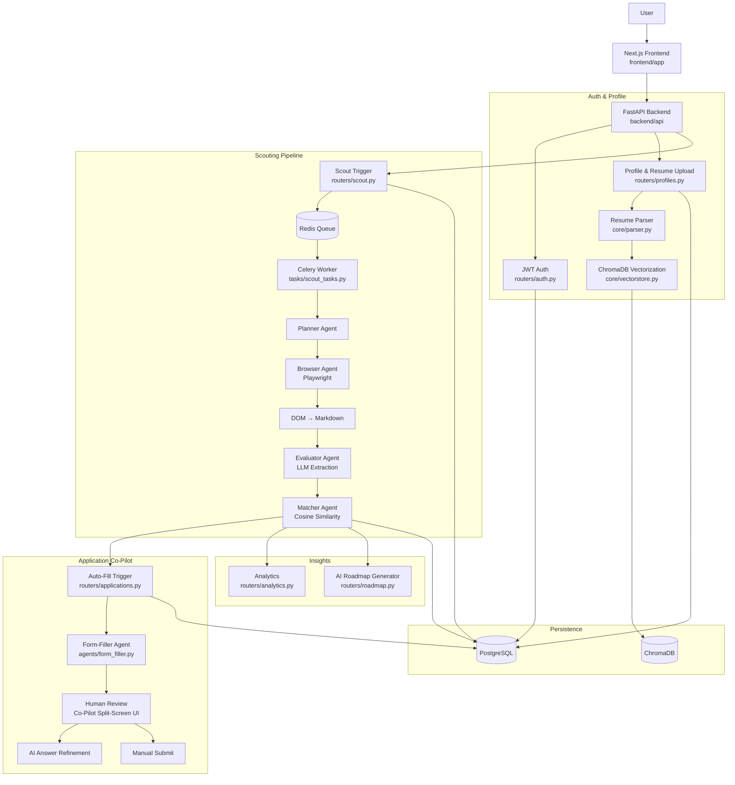

# ScoutSphere

<div align="center">


<h3>An autonomous multi-agent opportunity discovery & application engine</h3>

<p><em>ScoutSphere is a personalized AI scout that navigates the web to find internships and hackathons, evaluates them against your profile, and assists you in applying — with a mandatory human-in-the-loop review before anything is ever submitted.</em></p>

</div>

> ⚠️ **This project is under active development as a semester-length capstone build.** Phases 1–4 (foundation, scouting agents, matching, and the application co-pilot) are implemented. Phase 5 (observability, notifications, production deployment) is still in progress. See [Project status](#-project-status) below for what's real today.

## ✨ What ScoutSphere does

Students and early-career professionals lose hours every week manually checking Devpost, company career pages, and university boards for internships and hackathons — and still miss deadlines or apply to roles they're not eligible for. ScoutSphere closes that loop end-to-end:

- **Autonomous Scouting**: Background Celery agents crawl seed URLs on a schedule, extract listings from dynamically rendered pages, and convert the DOM into clean Markdown for LLM parsing.
- **AI Evaluation Engine**: A Planner → Browser → Evaluator agent chain extracts structured opportunity data (title, deadline, requirements) and scores it against a vector-embedded user profile via cosine similarity across weighted factors — Skills, Eligibility, Location, Experience, and Deadline Urgency.
- **Personalized Discovery Dashboard**: Curated, match-scored opportunities surface on a dashboard instead of a fragmented, manual search, with an AI Match Analysis view (strong areas, missing skills, score breakdown).
- **Form-Filler Co-Pilot**: A Playwright-driven agent maps profile data onto real application forms, then **pauses for mandatory human review** in a side-by-side Co-Pilot workspace — the system never submits on autopilot. Includes AI-assisted answer refinement for open-ended questions.
- **Application Tracking**: A Kanban-style board tracks applications through their lifecycle after submission.
- **Career Roadmap Generation**: AI-generated personalized roadmaps based on profile gaps against target opportunities.
- **Analytics**: Weekly activity and application-outcome analytics for the user.

## 🧭 Project status

Built in phases, following the project's own Implementation Plan. Current state:

| Phase | Scope | Status |
| --- | --- | --- |
| **Phase 1** | FastAPI foundation, JWT auth, PostgreSQL schema + Alembic migrations, Redis/Celery infra, resume upload & parsing, ChromaDB profile vectorization, onboarding/auth UI, Docker sandbox spike, CI | ✅ Implemented |
| **Phase 2** | Planner / Browser / Evaluator agents, scouting pipeline, Celery scouting tasks, seed URL management | ✅ Implemented |
| **Phase 3** | Match scoring (Matcher agent), Discovery Dashboard, AI Match Analysis view, analytics endpoint | ✅ Implemented |
| **Phase 4** | Form-Filler agent, side-by-side Co-Pilot review UI, AI answer refinement, Application Tracking Kanban | ✅ Implemented |
| **Phase 5** | Observability, digest emails, production deployment, hardening | 🚧 In progress |

This README documents the system as a whole (per the project's SRS/PRD/TRD). Phase 5 items (email digests, structured logging/observability, cloud deployment) are the main remaining gap before this is production-ready — everything else in the original scope is wired end-to-end.

## 🧠 Architecture overview



## 🧩 Core components

| Area | Purpose | Key files |
| --- | --- | --- |
| **FastAPI app** | App entrypoint, CORS, router mounting, health checks | [backend/api/main.py](backend/api/main.py) |
| **JWT authentication** | Register/login, password hashing, access & refresh tokens | [backend/api/routers/auth.py](backend/api/routers/auth.py), [backend/core/security.py](backend/core/security.py) |
| **Profile & resume** | Resume upload, PDF parsing, profile persistence | [backend/api/routers/profiles.py](backend/api/routers/profiles.py), [backend/core/parser.py](backend/core/parser.py) |
| **Vector store** | Embeds resume/profile data into ChromaDB for semantic matching | [backend/core/vectorstore.py](backend/core/vectorstore.py) |
| **Scouting agents** | Planner (navigation strategy), Browser (Playwright DOM extraction), Evaluator (LLM extraction + scoring), Matcher (cosine similarity) | [backend/agents/](backend/agents) |
| **Scouting tasks & seeds** | Celery task definitions, seed URL trigger endpoint | [backend/tasks/scout_tasks.py](backend/tasks/scout_tasks.py), [backend/api/routers/scout.py](backend/api/routers/scout.py) |
| **Opportunities & matches** | Curated, match-scored opportunity listing | [backend/api/routers/opportunities.py](backend/api/routers/opportunities.py), [backend/models/opportunity.py](backend/models/opportunity.py), [backend/models/match.py](backend/models/match.py) |
| **Application co-pilot** | Auto-fill trigger, application status/submit, AI answer refinement | [backend/api/routers/applications.py](backend/api/routers/applications.py), [backend/agents/form_filler.py](backend/agents/form_filler.py), [backend/models/application.py](backend/models/application.py) |
| **Analytics & roadmap** | Weekly activity analytics, AI-generated career roadmap | [backend/api/routers/analytics.py](backend/api/routers/analytics.py), [backend/api/routers/roadmap.py](backend/api/routers/roadmap.py) |
| **Database models** | SQLAlchemy models mirroring the Backend & Database Schema doc | [backend/models/](backend/models) |
| **Migrations** | Alembic schema history (users → scouting → applications → resume text/skills gap columns) | [backend/alembic/versions/](backend/alembic/versions) |
| **Playwright sandbox** | Isolated Docker environment for headless browsing | [backend/docker/Dockerfile.playwright](backend/docker/Dockerfile.playwright) |
| **Frontend app** | Auth, onboarding, dashboard, Co-Pilot, roadmap, analytics (Next.js App Router) | [frontend/app/](frontend/app) |
| **UI components** | Glassmorphic design system: sidebar nav, match cards, glass cards | [frontend/components/](frontend/components) |

## 🛠 Tech stack

- **Backend**: Python 3.11+, FastAPI, Uvicorn, Pydantic v2, SQLAlchemy 2.0 (async)
- **Database**: PostgreSQL (relational), ChromaDB (vector store), Alembic (migrations)
- **Auth**: JWT (python-jose), bcrypt password hashing (passlib)
- **Background Jobs**: Celery + Redis (Celery Beat for scheduled scouting)
- **Agent Engine**: Playwright (headless browsing), Groq / OpenAI GPT-4o-mini (Evaluator, Roadmap, and answer-refinement LLM chains)
- **Resume Parsing**: pypdf
- **Frontend**: Next.js 16 (App Router), React 19, Tailwind CSS v4, Recharts, Lucide Icons
- **Testing**: pytest, pytest-asyncio, httpx
- **DevOps**: Docker Compose (Postgres, Redis, ChromaDB), GitHub Actions CI

## 📁 Repository layout

```text
.
├── backend/
│   ├── agents/               # Planner, Browser, Evaluator, Matcher, Form-Filler
│   ├── alembic/                # Migration environment and version history
│   ├── api/
│   │   └── routers/             # auth, profiles, scout, opportunities, applications, analytics, roadmap
│   ├── core/                      # Settings, DB session, security, parser, vectorstore, Celery app
│   ├── docker/                      # Playwright sandbox Dockerfile
│   ├── models/                        # SQLAlchemy ORM models (users, profiles, opportunities, matches, applications, ...)
│   ├── schemas/                         # Pydantic request/response schemas
│   ├── tasks/                             # Celery scouting task definitions
│   ├── tests/                               # pytest suite
│   ├── worker/                                # Celery beat schedule & config
│   └── requirements.txt
├── frontend/
│   ├── app/
│   │   ├── (dashboard)/                        # opportunities, matches, analytics, applications, scout, roadmap, profile, settings
│   │   ├── applications/co-pilot/[id]/          # Side-by-side human review workspace
│   │   ├── auth/login/                            # Auth screen
│   │   ├── onboarding/                              # Resume upload / preferences wizard
│   │   └── mock-job/                                  # Mock application form for local Co-Pilot testing
│   └── components/                                      # SidebarNav, MatchCard, GlassCard, Button, Input
├── .github/workflows/                                     # CI pipeline
├── docker-compose.yml                                       # Postgres, Redis, ChromaDB (local dev infra)
└── .env.example
```

## ⚙️ Prerequisites

- **Python 3.11+**
- **Node.js 18+** and **npm**
- **Docker Desktop** (or Docker Engine + Compose) for Postgres/Redis/ChromaDB
- An OpenAI or Groq API key (used by the Evaluator, Roadmap generator, and answer-refinement agents)

## 🔐 Environment variables

Copy [.env.example](.env.example) to `.env` in the project root and fill in real values (never commit `.env`):

| Variable | Required | Purpose |
| --- | --- | --- |
| `DATABASE_URL` | **Yes** | Async PostgreSQL connection string |
| `JWT_SECRET_KEY` | **Yes** | Signing key for access/refresh tokens |
| `REDIS_URL` | **Yes** | Redis connection for Celery broker/backend |
| `CHROMA_HOST` / `CHROMA_PORT` | **Yes** | ChromaDB connection for profile & opportunity embeddings |
| `OPENAI_API_KEY` | **Yes** | Evaluator agent, Roadmap generator, AI answer refinement |
| `ACCESS_TOKEN_EXPIRE_MINUTES` | Optional | Access token lifetime (default: `30`) |
| `REFRESH_TOKEN_EXPIRE_DAYS` | Optional | Refresh token lifetime (default: `7`) |
| `RESUME_STORAGE_DIR` | Optional | Local storage path for uploaded resumes |
| `RESUME_ENCRYPTION_KEY` | Optional | Fernet key for encrypting resume files at rest |
| `BACKEND_CORS_ORIGINS` | Optional | Allowed frontend origins (default: `["http://localhost:3000"]`) |

## ▶️ Local setup

### 1) Start infra (Postgres, Redis, ChromaDB)

```bash
docker compose up -d postgres redis chromadb
```

### 2) Backend API

```bash
python3 -m venv .venv
source .venv/bin/activate        # Windows: .venv\Scripts\activate
pip install -r backend/requirements.txt

alembic -c backend/alembic.ini upgrade head
uvicorn backend.api.main:app --reload --port 8000
```

- **API Base**: `http://localhost:8000`
- **Health Check**: `http://localhost:8000/health`
- **Swagger Docs**: `http://localhost:8000/docs`

### 3) Celery worker + beat (scouting pipeline)

```bash
celery -A backend.core.celery_app worker --loglevel=info
celery -A backend.core.celery_app beat --loglevel=info
```

### 4) Frontend

```bash
cd frontend
npm install
npm run dev
```

The app runs at `http://localhost:3000`. Use `/mock-job` locally to test the Form-Filler / Co-Pilot flow against a safe, non-live target page.

## 🧪 Testing

```bash
pytest backend/tests -v
ruff check backend
```

CI runs both automatically on every pull request — see [.github/workflows/backend-ci.yml](.github/workflows/backend-ci.yml).

## 🔗 API overview (current)

| Method | Endpoint | Description |
| --- | --- | --- |
| `GET` | `/health` | Server health check |
| `POST` | `/auth/register` | Create a new user account |
| `POST` | `/auth/login` | Authenticate and receive JWT access/refresh tokens |
| `PUT` | `/users/me/profile` | Upload resume, trigger parsing and ChromaDB vector sync |
| `POST` | `/scout/trigger` | Enqueue a scouting task |
| `GET` | `/scout/opportunities` | List scouted opportunities |
| `POST` | `/scout/seeds` | Register a seed URL for scouting |
| `GET` | `/opportunities/matches` | Get match-scored opportunities for the user |
| `GET` | `/applications` | List the user's applications |
| `POST` | `/applications/auto-fill/{opportunity_id}` | Trigger the Form-Filler agent for an opportunity |
| `GET` | `/applications/{application_id}/status` | Poll application/form-fill status |
| `PUT` | `/applications/{application_id}/submit` | Confirm human review and finalize submission |
| `POST` | `/applications/{application_id}/refine` | AI-refine a drafted application answer |
| `GET` | `/analytics` | Weekly activity and outcome analytics |
| `POST` | `/roadmap/generate` | Generate an AI career roadmap from profile gaps |

## 🗺 Roadmap

- [x] Phase 1 — Foundation: auth, schema, profile/resume pipeline, infra, CI
- [x] Phase 2 — Core agent & scouting pipeline (Planner, Browser, Evaluator)
- [x] Phase 3 — AI matching & Discovery Dashboard UI
- [x] Phase 4 — Application co-pilot & human-in-the-loop review
- [ ] Phase 5 — Observability, notifications, deployment

Full detail lives in the project's Implementation Plan, PRD, TRD, and SRS documents.

## 🤝 Contributing

This is a solo capstone-style build in active development. Issues and suggestions are welcome via GitHub Issues.

## 📄 License

MIT — see [LICENSE](LICENSE).